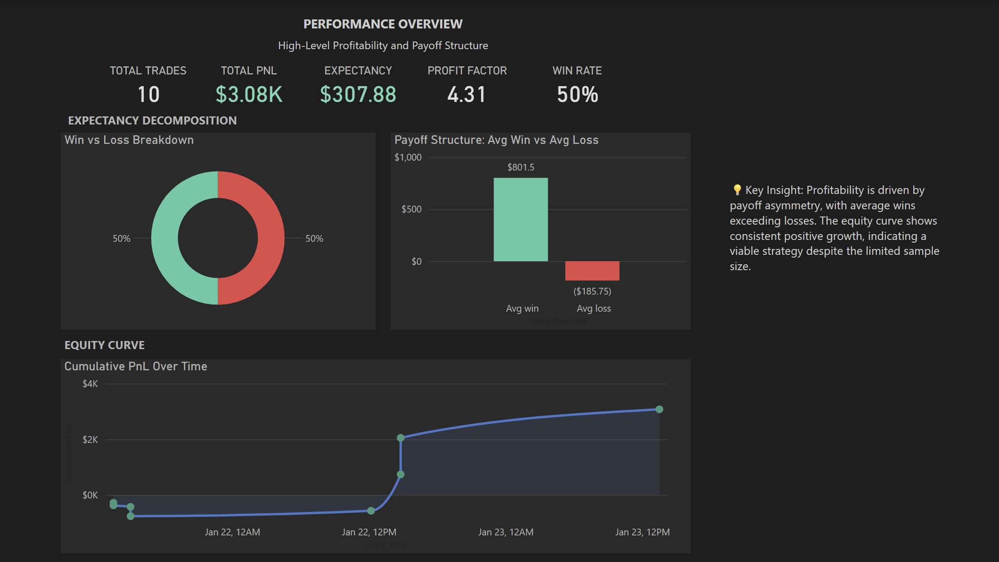
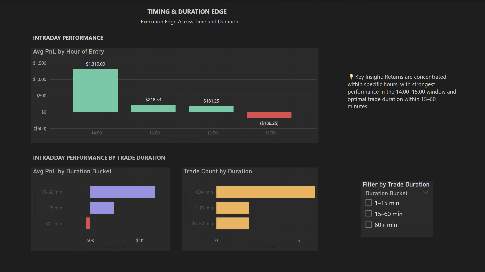
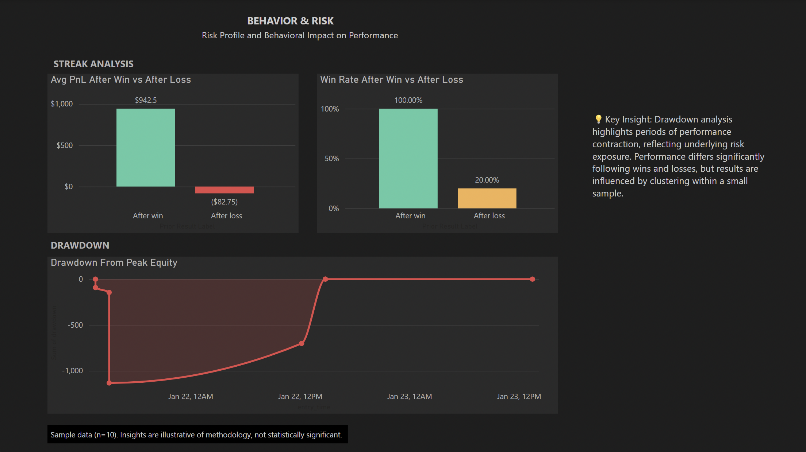

# Trading Performance Analysis Dashboard

I analyzed a small set of trades to answer a bigger question: what actually drives profitability—win rate, timing, or behavior?

This dashboard breaks performance down into expectancy, execution edge, and risk.

---

## Dashboard Preview

### Performance Overview

### Timing & Duration Edge

### Behavior & Risk

---

## Executive Summary

Profitability is driven by payoff asymmetry, with average wins exceeding losses and a positive equity curve. Returns are concentrated within the 14:00–15:00 CET window and 15–60 minute trade durations, indicating a time-based execution edge. Drawdowns are present but contained, with overall performance remaining stable. Streak analysis suggests variation across sequences; however, the small and clustered sample limits any conclusions regarding behavioral effects.

---

## Overview

This project evaluates trading performance beyond simple win rate metrics by decomposing profitability into its core drivers: expectancy, timing, and behavioral consistency.

Using SQL for data transformation and Power BI for visualization, the analysis provides a structured framework for understanding how trade outcomes, execution timing, and risk dynamics interact.

---

## Data Sources

- Historical trade-level data (P&L, timestamps, duration)  
- Risk metrics (position sizing, exposure)  
- Intraday trade records across a defined trading window  

---

## Methodology

- Structured and standardized raw trade data using SQL and Excel  
- Validated data consistency and handled missing or inconsistent entries  
- Developed core performance metrics (expectancy, drawdown, profit factor)  
- Analyzed performance across trade sequences with awareness of sample size limitations  
- Explored variation in outcomes across intraday timing and trade duration  

---

## Key Metrics

- **Expectancy (Avg PnL per Trade)** – Measures average profitability per trade  
- **Win Rate (%)** – Percentage of profitable trades  
- **Profit Factor** – Ratio of total profits to total losses  
- **Drawdown** – Decline from peak equity, capturing downside risk  
- **Cumulative PnL** – Running total of performance over time  

---

## Dashboard Structure

### 1. Performance Overview
- High-level profitability metrics (Expectancy, Win Rate, Profit Factor)  
- Payoff structure (Average Win vs Average Loss)  
- Equity curve (Cumulative PnL over time)  

### 2. Timing & Duration Edge
- Intraday performance by trade entry hour  
- Performance by trade duration  
- Trade distribution across holding periods  

### 3. Behavior & Risk Analysis
- Drawdown from peak equity  
- Performance following winning vs losing trades  
- Win rate conditional on prior trade outcome  

---

## Technical Implementation

### SQL
- Built a raw-to-clean transformation pipeline to standardize trade data, resolving datetime inconsistencies and non-standard numeric formats (e.g., bracketed negatives)
- Performed data transformation and feature engineering to support time-based and behavioral analysis
- Leveraged window functions (SUM OVER, LAG) to construct:
  - Equity curve (cumulative PnL)
  - Drawdown from peak
  - Trade outcome sequencing (streak analysis)
- Created reusable analytical views to support downstream visualization in Power BI

### Power BI
- Designed an interactive dashboard to communicate performance, timing edge, and risk
- Built time-series visuals for equity curve and drawdown analysis
- Developed KPI cards and categorical breakdowns for performance decomposition
- Applied Power Query and DAX for additional data shaping and metric calculations
- Implemented custom tooltips to surface trade-level context without cluttering visuals

---

## Limitations

- Small sample size (10 trades), limiting statistical significance  
- Results are illustrative of methodology rather than definitive conclusions  
- Time-based and behavioral patterns may not generalize to larger datasets  

---

## Future Improvements

- Expand dataset to improve statistical reliability  
- Incorporate rolling performance metrics (e.g., rolling expectancy)  
- Add risk-adjusted measures (Sharpe ratio, volatility)
- Integrate real-time or automated data pipelines

---

## Key Takeaway

Profitability in this dataset is driven more by payoff structure and execution timing than by win rate alone, highlighting the importance of trade management and risk control. Streak analysis suggests variation across sequences; however, the small and clustered sample limits any conclusions about behavioral effects.

---
